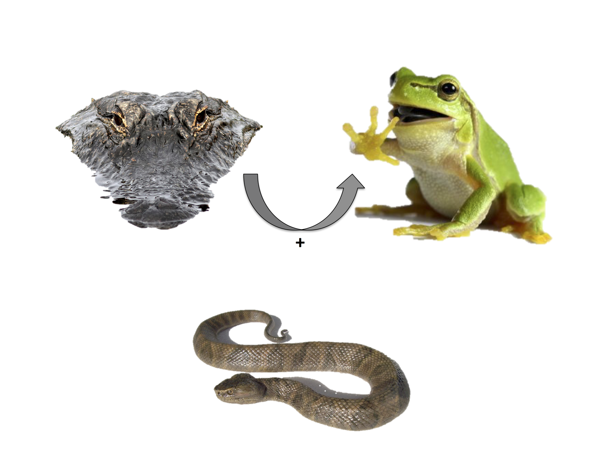
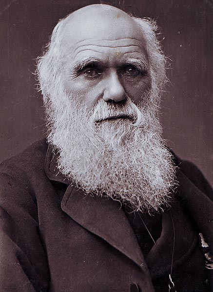

## Acknowledgements

- *Tom Whitham* (Northern Arizona University)
- *Stuart Borrett* (UNC Wilmington)
- *Stephen Shuster* (Northern Arizona University)
- *Jamie Lamit* (Michigan Technical University)
- *Art Keith* (Northern Arizona University)
- *Todd Wojtowicz* (Northern Arizona University)
- *Rikke Naesborg* (UC Berkeley)
- David Solance Smith (Denison College)
- Matt Zinkgraf (UC Davis)
- Luke Evans (West Virginia University)
- **bipartite** (Dormann *et al.* 2008)

## Take Home Slide

>- Ecological and evolutionary processes are linked.
- Eco-evo investigations have focused on species pairs, while network
  ecology has little genetics.
- We investigated how genetically based variation in a foundation
  species impacts the structure of ecological networks.
- **Take-home**: genetic variation in a foundation species can impact
  ecological network structure, which could influence the dynamics and
  evolution of complex communities.
  
----
## The interface of ecology and evolution

Bailey et al. 2012 *New Phytologist*

## Why study networks?

## Why study networks?

## Why study networks?

Bondavalli and Ulanowicz 1999 *Ecosystems*

## Why study networks?

Bondavalli and Ulanowicz 1999 *Ecosystems*

## Why study networks?

Bondavalli and Ulanowicz 1999 *Ecosystems*

## Why study networks?

Bondavalli and Ulanowicz 1999 *Ecosystems*

## Network Structure: Modularity

Fortuna *et al.* 2009 

## Why study evolution of networks?

Knight et al. 2005 *Nature*

## Utah from outer-space

Ogden Nature Center

## Utah at ground-level

## 

## 

## Keith et al. 2010 *Ecology*

## Genotype-Species Network

Lau et al. (submitted *Ecology*)

## Genotype-Species Network

>- Modular network structure (*z* =3.82, *P* = 0.038)

Lau et al. (submitted *Ecology*)

## Simulated communities

## Simulated communities

**Warning - Math!**

## Simulated communities
Shuster et al. 2006

\[ n^{*}_{ij} = K [1 - \frac{\gamma}{2} \sigma^2_{z_{ij}} - \frac{\gamma}{2} (\theta_i - \bar{z}^{*}_{ij})] + E_{n_{ij}}
\]

## Simulated communities
Shuster et al. 2006

\[ n^{*}_{ij} = K [1 - \frac{\gamma}{2} \sigma^2_{z_{ij}} - \frac{\gamma}{2} (\theta_i - \bar{z}^{*}_{ij})] + E_{n_{ij}}
\]

## Simulated communities
Shuster et al. 2006

\[ n^{*}_{ij} = K [1 - \frac{\gamma}{2} \sigma^2_{z_{ij}} - \frac{\gamma}{2} (\theta_i - \bar{z}^{*}_{ij})] + E_{n_{ij}}
\]

## Simulated communities
Shuster et al. 2006

\[ n^{*}_{ij} = K [1 - \frac{\gamma}{2} \sigma^2_{z_{ij}} - \frac{\gamma}{2} (\theta_i - \bar{z}^{*}_{ij})] + E_{n_{ij}}
\]

## Simulated communities

Lau et al. (submitted *Ecology*)

## Genotypes -> network structure

Lau et al. (submitted *Ecology*)

## Lichen Interaction Networks

## Lichen Interaction Networks

<!-- ## Lichen - Garden and Wild -->
<!-- 
 -->
<!-- 
<!-- generates interaction network structure" width=600> -->
<!-- 
 -->
<!-- Lau et al. (In Prep) -->

## Lichen - Garden and Wild

Lau et al. (In Prep)

## Lichen - Garden and Wild

Lau et al. (In Prep)

## Conclusions

## All models are wrong: some are useful...

## All models are wrong: some are useful, some are not.

## Selection: Impacts on Networks

Connor & Hartl 2004 *A Primer of Ecological Genetics*

## (Human)-Assisted Evolution

- Van Oppen et al. 2015 *PNAS*

----

Thanks!

## Acknowledgements

- Tom Whitham (Northern Arizona University)
- Stuart Borrett (UNC Wilmington)
- Stephen Shuster (Northern Arizona University)
- Jamie Lamit (Michigan Technical University)
- Todd Wojtowicz (Northern Arizona University)
- Art Keith (Northern Arizona University)
- David Solance Smith (Denison College)
- Matt Zinkgraf (UC Davis)
- Luke Evans (West Virginia University)
- Rikke Naesborg (UC Berkeley)
- **bipartite** (Dormann *et al.* 2008)
